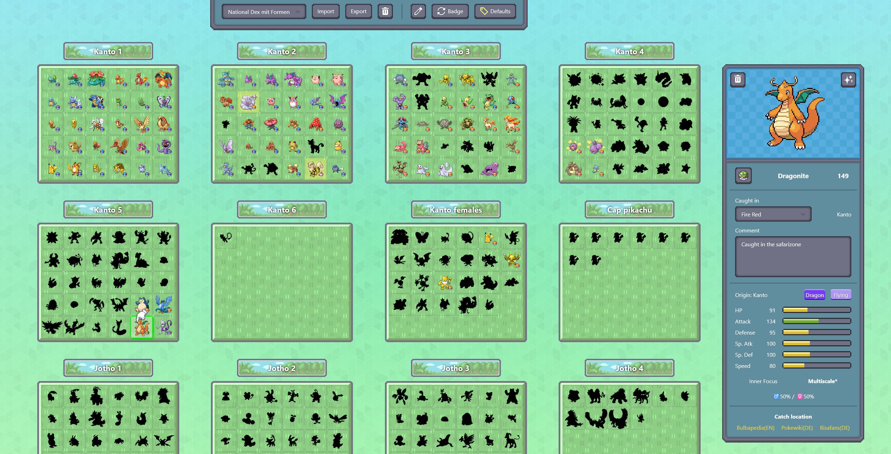

# 📦 PK Box Manager

A fast, lightweight, and mostly local Svelte app to manage your Living Pokédex.
Userdata is managed entirely in the browsers localStorage.



## Features

Track detailed information for each Pokémon, including:

- 🎯 Pokéball used
- ✨ Shiny status
- 🎮 Game of origin
- 📝 Custom comments

Additional highlights:

- ⚙️ **Default values**: Set default capture values (e.g. ball, game) to speed up marking caught Pokémon.
- 📊 **Pokémon info display**: Shows base stats, typing, abilities, and gender ratio (fetched via API).
- 🔗 **Quick wiki access**: Direct links to popular wikis for encounter locations of the selected Pokémon.
- 📁 **Import & export**: Backup or share your dex progress via JSON file.
- 👀 **Visual ball indicator**: Shows the caught Pokéball directly in the box view

## Prerequisites

The following Programmes are required in order to generate the image assets for the application:

- **Node.js / Deno** (for dev server & build scripts)
- **Deno** (sprite-sheet generation scripts)
- **ImageMagick** (`convert`, `montage`)
- **cwebp** (WebP encoder)
- **Bash** (for helper scripts)

## Installation

```sh
# Clone the repo
git clone https://github.com/777555777/pk-box-manager
cd pk-box-manager

# Install dependencies
deno install

# Start dev server
deno task build && deno task dev

# Start preview server
deno task preview
```

> ### Note: Clear browser localstorage to reset app state

### Asset Preparation

```sh
# Generate all sprite sheets (requires Deno and ImageMagick)
deno task sprites

# Convert .png images in /static to WebP (requires ImageMagick & cwebp CLI)
deno task webp
```

## Structure

```sh
📁 /project-data
├── 📁 /images         # Source images used to generate spritesheets
└── 📁 /src            # Deno scripts for generating spritesheets

📁 /src
├── 📁 /lib
│   ├── 📁 /components  # UI components used across the app
│   ├── 📁 /models      # Type definitions & utilities for sprite data
│   └── 📁 /state       # Global app state & localStorage persistence
└── 📁 /routes          # Main app page & server-side API endpoints

📁 /static
├── 📁 /boxes           # Image assets representing Pokémon storage boxes
├── 📁 /origin-marks    # Icons showing a Pokémon's game of origin
├── 📁 /spritesheets    # Generated sprite sheets (normal, shiny, forms, etc.)
└── 📁 /ui              # UI elements like buttons, icons, etc.
```
